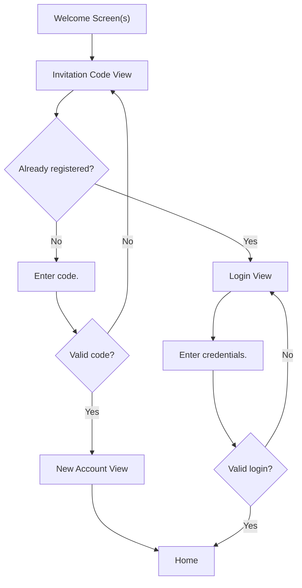

<!--

This source file is part of the Stanford Spezi open-source project.

SPDX-FileCopyrightText: 2022 Stanford University and the project authors (see CONTRIBUTORS.md)

SPDX-License-Identifier: MIT
  
-->

# Spezi Invitation Code

Our Firestore instance also contains a collection called `invitationCodes` with a fixed set of secret, randomly generated codes. During onboarding, we sign the user in anonymously so we can check if they have a valid code. If they do, we assign that code to their new de-anonymized account and remove it from `invitationCodes` so it cannot be used again. This system is designed to hedge against spam and unapproved use.



To set up invitation code verification for in a client-side application, you must first set up the cload function on the server side:

```javascript
const admin = require("firebase-admin");
const {onCall} = require("firebase-functions/v2/https");
const {beforeUserCreated} = require("firebase-functions/v2/auth");

admin.initializeApp();

const invitationCodeVerifier = new InvitationCodeVerifier(
  "invitationCodes",
  "users",
  /^[A-Z0-9]{6}$/
);

exports.checkInvitationCode = onCall(async (request) => {
  try {
    const {invitationCode} = request.data;
    await invitationCodeVerifier.enrollUserInStudy(request, invitationCode);
    return {success: true};
  } catch (error) {
    console.error("Error enrolling user:", error);
    throw error;
  }
});

exports.beforecreated = beforeUserCreated(async (event) => {
  try {
    const userId = event.data.uid;
    await invitationCodeVerifier.validateUserInvitationCode(userId);
  } catch (error) {
    console.error("Error validating user invitation code:", error);
    throw error;
  }
});
```

Then call `checkInvitationCode` using one of the [Firebase client SDKs](https://firebase.google.com/docs/functions/callable?gen=2nd), passing the invitation code as data.

The `beforecreated` function will automatically run before each new user is created in Firebase Authentication, ensuring that the user has a valid invitation code associated with their account.

Anytime someone tries to sign up for an account, a blocking cloud function will automatically be triggered, denying sign-up access to users who enter invalid invitation codes.
Since the Firebase instance is set up only to accept authenticated requests, this system eliminates the ability for anyone without an invitation code to send samples to our servers.
